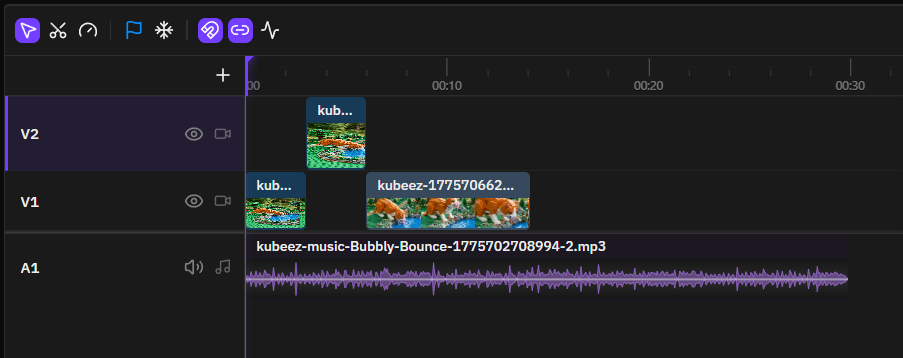
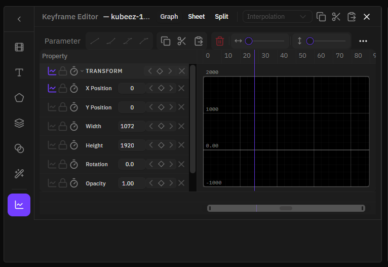
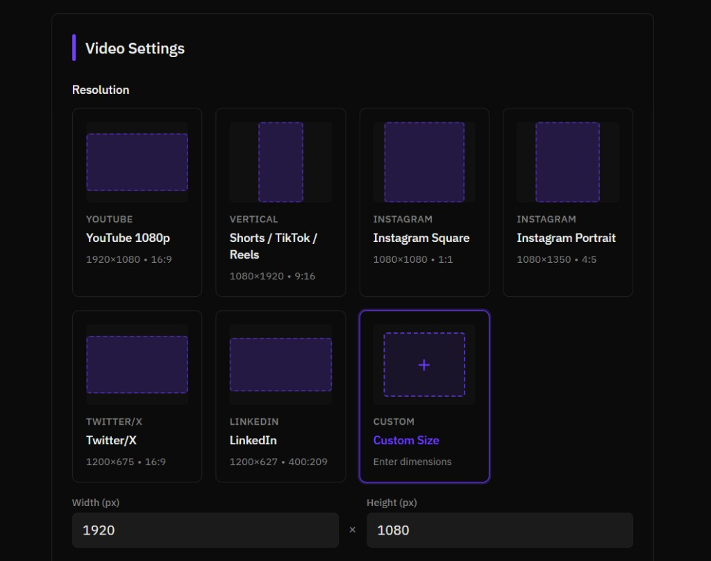
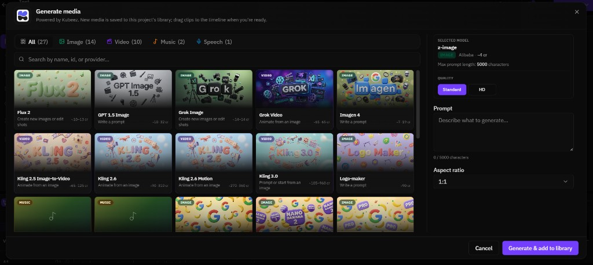
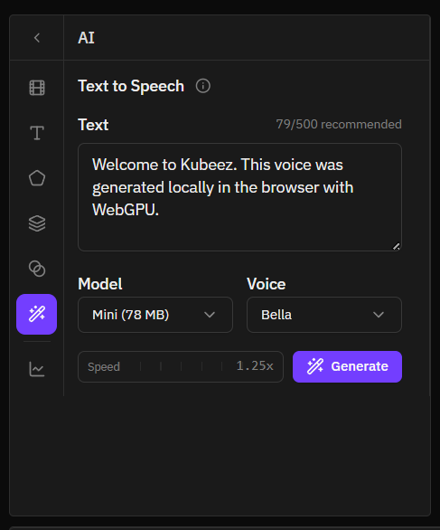

<div align="center">


# KubeezCut

### Professional video editing — entirely in your browser

No installation. No uploads. No subscriptions.
Everything runs locally using **WebGPU**, **WebCodecs**, and the **File System Access API**.

[](LICENSE)
[](https://www.typescriptlang.org/)
[](https://react.dev/)
[](#browser-support)
[](https://vitejs.dev/)

</div>

---

<div align="center">



</div>

---

## What is KubeezCut?

KubeezCut is a fully client-side, multi-track video editor that runs without a backend. Your media never leaves your machine — everything from decoding to rendering to export happens locally inside the browser tab, powered by modern web platform APIs.

- **GPU-accelerated** — effects, compositing, and transitions run as WebGPU compute shaders
- **Frame-accurate** — custom Clock engine with WebCodecs-based export
- **Non-destructive** — full undo/redo, keyframe animation, and project bundling
- **Private by design** — no server, no cloud, no account required

**Media generation** — [Kubeez](https://kubeez.com) is the media generation platform for creating AI-generated assets you can bring into KubeezCut (see **Generate media** in [Screenshots](#screenshots)).

---

## Screenshots

Landing images live in [`public/assets/landing/`](./public/assets/landing/):

| File | What's shown |
|------|----------------|
| `timeline.png` | Multi-track timeline (video + audio, tools, waveforms) |
| `keyframe.png` | Keyframe editor — graph / sheet / split view |
| `projects.png` | Video settings — resolution presets (YouTube, Shorts, etc.) and custom canvas |
| `ai-generation.png` | [Kubeez](https://kubeez.com) (**Generate media**) — model catalog and prompt panel |
| `local-tts.png` | AI sidebar — **Text to Speech** (local WebGPU, Kitten TTS) |

<div align="center">

| Timeline & editing | Keyframe editor |
|:------------------:|:---------------:|
|  |  |

| Video settings (project canvas) | [Kubeez](https://kubeez.com) — Generate media |
|:--------------------------------:|:------------------------:|
|  |  |

| Local AI — Text to Speech |
|:-------------------------:|
|  |

</div>

**Export** — Encoding runs in the browser (WebCodecs: MP4, WebM, MOV, MKV; see **Export** under [Features](#features)). Output size matches your project canvas; the **Video settings** screenshot above is where preset resolutions and custom width/height are chosen.

---

## Features

### Timeline & Editing

- Multi-track timeline — video, audio, text, image, and shape tracks
- Track groups with mute / visible / locked gate propagation
- Trim, split, join, ripple delete, and rate stretch tools
- Rolling edit, ripple edit, slip, and slide tools
- Per-track **Close Gaps** — removes dead space between clips
- Filmstrip thumbnails and audio waveform visualization
- Pre-compositions (nested sub-comps, 1 level deep)
- Timeline markers for organizing long edits
- Source monitor with mark in/out via playhead or skimmer, plus insert/overwrite edits
- Configurable undo/redo history depth

### GPU Effects

All visual effects run as **WebGPU shaders** — zero CPU overhead during preview.

| Category | Effects |
|---|---|
| **Blur** | Gaussian, box, motion, radial, zoom |
| **Color** | Brightness, contrast, exposure, hue shift, saturation, vibrance, temperature/tint, levels, curves, color wheels, grayscale, sepia, invert |
| **Distortion** | Pixelate, RGB split, twirl, wave, bulge/pinch, kaleidoscope, mirror, fluted glass |
| **Stylize** | Vignette, film grain, sharpen, posterize, glow, edge detect, scanlines, color glitch |
| **Keying** | Chroma key (green/blue screen) with tolerance, softness, and spill suppression |

### Blend Modes

**25 GPU-accelerated blend modes** — normal, darken, multiply, color burn, linear burn, lighten, screen, color dodge, linear dodge, overlay, soft light, hard light, vivid light, linear light, pin light, hard mix, difference, exclusion, subtract, divide, hue, saturation, color, luminosity.

### Transitions

- **All-GPU pipeline** — dissolve, sparkles, glitch, light leak, pixelate, chromatic aberration, radial blur
- **Standard transitions** — fade, wipe, slide, 3D flip, clock wipe, iris (with directional variants)
- Adjustable duration and alignment per transition

### Keyframe Animation

- Bezier curve editor with preset easing functions
- Easing presets: linear, ease-in/out, cubic-bezier, spring
- Auto-keyframe mode for hands-free recording
- Graph editor, dopesheet, and split view

### Export

In-browser export via WebCodecs — no server required.

| | Options |
|---|---|
| **Containers** | MP4, WebM, MOV, MKV |
| **Video codecs** | H.264, H.265, VP8, VP9, AV1 |
| **Audio formats** | MP3, AAC, WAV (PCM) |
| **Quality presets** | Low (2 Mbps) → Ultra (20 Mbps) |

### Media Import

| Format | Supported |
|---|---|
| **Video** | MP4, WebM, MOV, MKV |
| **Audio** | MP3, WAV, AAC, OGG, Opus |
| **Image** | JPG, PNG, GIF (animated), WebP |
| **Max file size** | 5 GB |

- Files are **referenced** via the File System Access API — never copied
- OPFS proxy generation for smooth preview on high-bitrate sources
- Media relinking for moved or missing files
- Scene detection and optical flow analysis

### Transcription

- Browser-based speech-to-text via **Whisper** (runs in a Web Worker, fully local)
- Models: Tiny, Base, Small, Large v3 Turbo
- Auto-generate caption text items from transcripts
- Multi-language support

### More

- Native SVG shapes — rectangle, circle, triangle, ellipse, star, polygon, heart
- Text overlays with custom fonts, colors, and positioning
- **GPU scopes** — waveform, vectorscope, histogram
- Transform gizmo — drag, resize, rotate directly in the preview
- Layer masks with keyframeable geometry transforms
- Project bundles — export/import projects as ZIP files
- IndexedDB content-addressable storage with auto-save
- Customizable keyboard shortcuts with preset import/export

---

## Quick Start

**Prerequisites:** Node.js 18+ and Chrome or Edge 113+

```bash
git clone https://github.com/MeepCastana/KubeezCut.git
cd KubeezCut
npm install
npm run dev
```

Open [http://localhost:5173](http://localhost:5173) in Chrome.

### Workflow

1. **Create a project** from the projects page
2. **Import media** by dragging files into the media library
3. **Build your edit** — drag clips to the timeline, trim, arrange, add effects and transitions
4. **Animate** with the keyframe editor
5. **Preview** in real time with GPU compositing
6. **Export** directly from the browser — no upload, no wait

---

## Browser Support

Chrome or Edge 113+ is required. KubeezCut relies on **WebGPU**, **WebCodecs**, **OPFS**, and the **File System Access API** — all of which need a modern Chromium browser.

> **Brave users** — Brave disables the File System Access API by default.
> Navigate to `brave://flags/#file-system-access-api`, set it to **Enabled**, and relaunch.

---

## Keyboard Shortcuts

| Action | Shortcut |
|---|---|
| Play / Pause | `Space` |
| Previous / Next frame | `←` / `→` |
| Previous / Next snap point | `↑` / `↓` |
| Go to start / end | `Home` / `End` |
| Split at playhead | `Ctrl+K` |
| Split at cursor | `Shift+C` |
| Join clips | `Shift+J` |
| Delete selected | `Delete` |
| Ripple delete | `Ctrl+Delete` |
| Freeze frame | `Shift+F` |
| Nudge item | `Shift+Arrow` / `Ctrl+Shift+Arrow` |
| Undo / Redo | `Ctrl+Z` / `Ctrl+Shift+Z` |
| Copy / Cut / Paste | `Ctrl+C` / `Ctrl+X` / `Ctrl+V` |
| Selection tool | `V` |
| Razor tool | `C` |
| Rate stretch | `R` |
| Rolling edit | `N` |
| Ripple edit | `B` |
| Slip | `Y` |
| Slide | `U` |
| Toggle snap | `S` |
| Add / Remove marker | `M` / `Shift+M` |
| Add keyframe | `A` |
| Toggle keyframe editor | `Ctrl+Shift+A` |
| Mark In / Out | `I` / `O` |
| Insert / Overwrite edit | `,` / `.` |
| Zoom in / out | `Ctrl+=` / `Ctrl+-` |
| Zoom to fit | `\` |
| Save | `Ctrl+S` |
| Export | `Ctrl+Shift+E` |

See the in-app shortcuts dialog for the complete list.

---

## Tech Stack

| Layer | Technology |
|---|---|
| **UI** | React 19, TypeScript 5.9, Tailwind CSS 4, shadcn/ui |
| **Routing** | TanStack Router (file-based, type-safe) |
| **State** | Zustand 5 + Zundo (undo/redo) |
| **GPU** | WebGPU — effects, compositing, transitions, scopes |
| **Decoding** | Mediabunny (WASM-accelerated media decode) |
| **Encoding** | WebCodecs — browser-native encode and export |
| **Storage** | OPFS + IndexedDB via `idb` |
| **Parallelism** | Web Workers for export, decode, transcription, scene detection |
| **Build** | Vite 6 with manual chunk splitting |

---

## Development

```bash
npm run dev            # Dev server on port 5173
npm run dev:quiet      # Dev server without debug panel
npm run dev:compare    # Run dev + perf preview side-by-side
npm run build          # Production build
npm run lint           # ESLint
npm run test           # Vitest (watch mode)
npm run test:run       # Vitest (single run)
npm run test:coverage  # Coverage report
npm run routes         # Regenerate TanStack Router route tree
npm run verify         # Full CI gate: boundaries + lint + tests + build
```

### Architecture checks (enforced pre-push)

```bash
npm run check:boundaries           # Feature isolation boundaries
npm run check:deps-contracts       # Deps contract seam routing
npm run check:legacy-lib-imports   # Block direct @/lib/* usage
npm run check:deps-wrapper-health  # Unused pass-through deps wrappers
npm run check:edge-budgets         # Feature seam coupling budgets
```

### Performance workflow

```bash
npm run perf           # Build + serve a production-like local target (port 4173)
npm run dev:compare    # Compare dev (5173) vs prod-like (4173) side-by-side
```

Use `npm run perf` to distinguish real regressions from dev-mode noise (React overhead, HMR, debug instrumentation).

---

## Repository Layout

```
src/
├── app/                     # App bootstrap, providers, debug panel
├── domain/                  # Framework-agnostic domain logic
│   └── timeline/            # Transitions engine, registry, and renderers
├── infrastructure/          # Browser/storage/GPU adapters
├── lib/
│   ├── gpu-effects/         # WebGPU effect pipeline + shader definitions
│   ├── gpu-transitions/     # WebGPU transition pipeline + shaders
│   ├── gpu-compositor/      # WebGPU blend mode compositor
│   ├── gpu-scopes/          # Waveform, vectorscope, histogram renderers
│   ├── masks/               # Mask texture management
│   ├── analysis/            # Optical flow and scene detection
│   ├── thumbnails/          # GPU-accelerated thumbnail renderer
│   ├── fonts/               # Font loading
│   ├── shapes/              # Shape path generators
│   └── migrations/          # Versioned data migration system
├── features/
│   ├── editor/              # Editor shell, toolbar, panels, stores
│   ├── timeline/            # Multi-track timeline, actions, services
│   ├── preview/             # Preview canvas, transform gizmo, GPU scopes
│   ├── player/              # Playback engine (Clock, composition)
│   ├── composition-runtime/ # Rendering sequences, items, audio, transitions
│   ├── export/              # WebCodecs export pipeline (Web Worker)
│   ├── effects/             # GPU effect system and UI panels
│   ├── keyframes/           # Keyframe animation, Bezier editor, easing
│   ├── media-library/       # Media import, metadata, OPFS proxies, transcription
│   ├── project-bundle/      # Project ZIP export/import
│   ├── projects/            # Project management
│   └── settings/            # App settings, keyboard shortcut editor
├── shared/                  # Shared UI, state, and utilities
├── components/ui/           # shadcn/ui base components
├── config/hotkeys.ts        # Keyboard shortcut definitions
├── routes/                  # TanStack Router (file-based, auto-generated)
└── types/                   # Shared TypeScript types
```

---

## License

[MIT](LICENSE) — free to use, modify, and distribute.